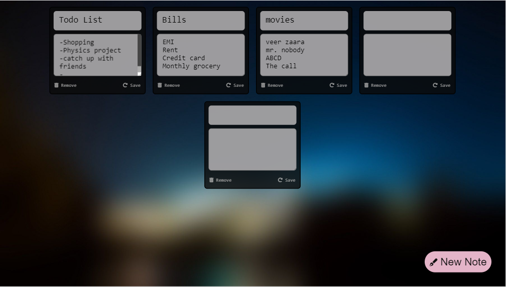

### Check out live demo: [here](https://titli9830.github.io/Insta-Notes/) 

OR

Download & run the code in your machine.

## Project Screenshots

### Mobile View:                                  

          

### Tablet View:

### Desktop View:

          

### Notes:

It's a simple Responsive web application to save important notes. This project is made using Java Script,HTML,CSS. Used Local storage to store data.
